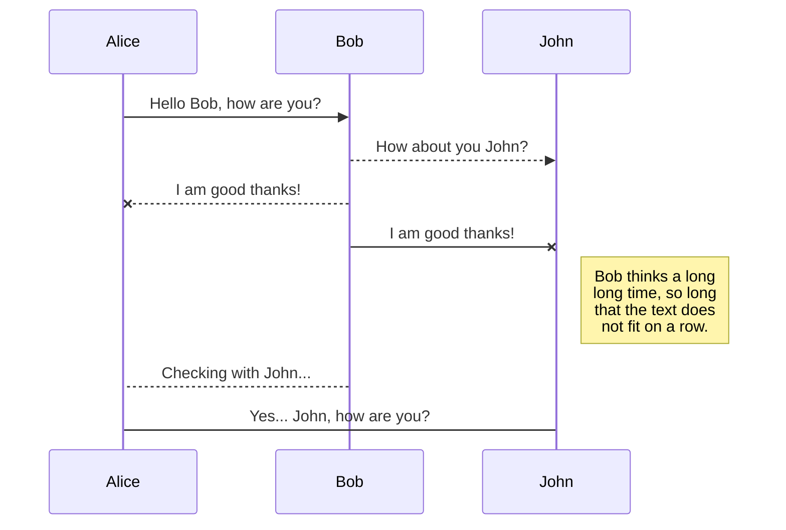
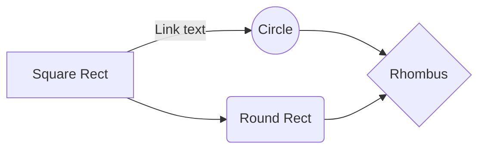

# EGDAR NLP REST Pipeline

This Project has 4 Stages
1. Annotation Pipeline
   - This is the starting point for the main pipeline. 
   - It Generates a Database of A Labeled Dataset using Azure Text Analytics API
   - Entire Database is stored in a AWS S3 bucket 
2. Machine Learning Pipeline
   - This is the second pipeline.
   - The Database creates in the Annotation Pipeline is used to train our model
   - The trained model is stored on a S3 bucket
3. REST Flask App
   - The trained model is incubated in a Python Flask REST App
   - The Flask App is tested inside a Docker Container
   - The Docker Container is Deployed on a Google Cloud Kubernetes Engine
4. Inference Pipeline
   - Inference Pipeline is an Automated Sentiment Analysis Pipeline
   - It scrapes EDGAR Earning Call Transcript Data and stores it in the cloud
   - Using the Flask Webapp in Stage 3, It predicts the sentiment of the document.


## Getting Started

These instructions will get you a copy of the project up and running on your Cloud Environment 
```
git clone www.github.com/kashishshah881/ml-as-a-service-pipeline
```

### Prerequisites

```
Python3.7
AWS Account
GCP Account
Microsoft Azure Account
```

### Installing

A step by step series of examples that tell you how to get a development env running

Say what the step will be

```
Give the example
```

And repeat

```
until finished
```

End with an example of getting some data out of the system or using it for a little demo


## Built With

* [Flask](http://www.dropwizard.io/1.0.2/docs/) - The web framework used
* [MetaFlow](https://maven.apache.org/) - Pipeline Creation
* [ROME](https://rometools.github.io/rome/) - Used to generate RSS Feeds


## Versioning

We use [SemVer](http://semver.org/) for versioning. For the versions available, see the [tags on this repository](https://github.com/your/project/tags). 

## Authors

* **Billie Thompson** - *Initial work* - [PurpleBooth](https://github.com/PurpleBooth)

See also the list of [contributors](https://github.com/your/project/contributors) who participated in this project.

## License

This project is licensed under the MIT License - see the [LICENSE.md](LICENSE.md) file for details

## Acknowledgments

* Hat tip to anyone whose code was used
* Inspiration
* etc


## SmartyPants

SmartyPants converts ASCII punctuation characters into "smart" typographic punctuation HTML entities. For example:

|                |ASCII                          |HTML                         |
|----------------|-------------------------------|-----------------------------|
|Single backticks|`'Isn't this fun?'`            |'Isn't this fun?'            |
|Quotes          |`"Isn't this fun?"`            |"Isn't this fun?"            |
|Dashes          |`-- is en-dash, --- is em-dash`|-- is en-dash, --- is em-dash|


## KaTeX

You can render LaTeX mathematical expressions using [KaTeX](https://khan.github.io/KaTeX/):

The *Gamma function* satisfying $\Gamma(n) = (n-1)!\quad\forall n\in\mathbb N$ is via the Euler integral

$$
\Gamma(z) = \int_0^\infty t^{z-1}e^{-t}dt\,.
$$

> You can find more information about **LaTeX** mathematical expressions [here](http://meta.math.stackexchange.com/questions/5020/mathjax-basic-tutorial-and-quick-reference).


## UML diagrams

You can render UML diagrams using [Mermaid](https://mermaidjs.github.io/). For example, this will produce a sequence diagram:



And this will produce a flow chart:


